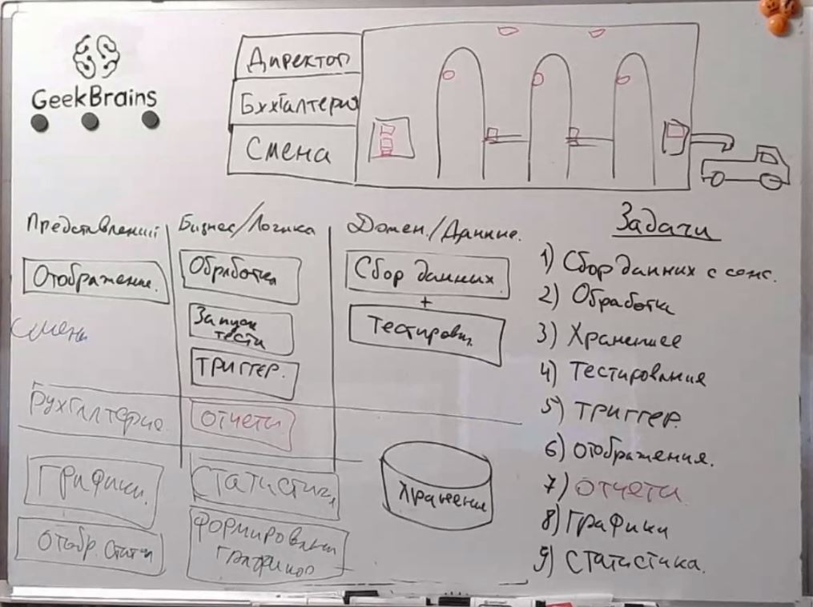
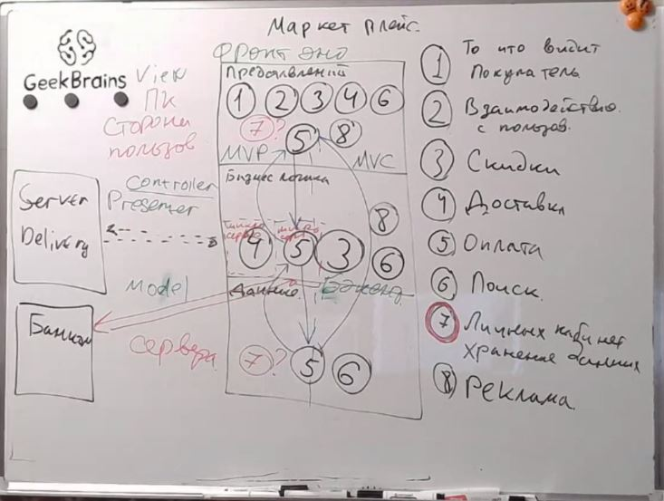

# Урок 5. Горизонтальные уровни и вертикальные срезы архитектуры
## Classwork
### Task001:
Структура пивзавода:

### Task002:
Структура маркетплейса:

## Homework
Сформировать компоненты для любой системы из задания. Выпустить диаграмму компонент UML(сдача в формате jpg файла на гите)
На выбор:
- UML диаграмма структуры маркетплейса
- UML диаграмма структуры Приложения контроля работы Пивзавода(смена, бухгалтерия и директор)
  (со звездочкой) Сделать реализацию на языке JAVA(python, c#, go, dart) по разработанной UML диаграмме.
